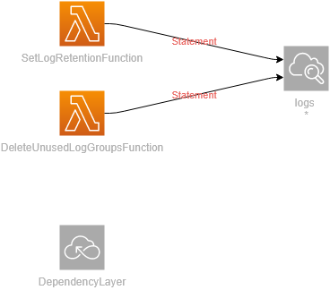

# Manage Lambda Logs Generated By SST

This is a fork of Allan Helton's project [here](https://github.com/allenheltondev/serverless-lambda-log-management) which was developed for use with AWS SAM. [SST](https://sst.dev) is my personal favourite means of deploying serverless applications so I've taken what Allan did and converted it to use SST and TypeScript.

## In This Stack

Two lambdas are provided in this stack:
* **delete-unused-log-groups** - Removes and lambda log groups that remained when a lambda resource name changed
* **set-log-retention** - Sets all lambda function log groups to have a retention period defined in an environment variable

## Schedule
 
The lambdas are triggered on a schedule so you don't have to maintain anything as you continue to build. The scheduled jobs/crons are added only if the environment variables `LOG_GROUP_RETENTION_CRON` and 
`LOG_GROUP_DELETE_CRON` are specified 

#### set-log-retention

It will set the log retention of all lambdas that do not match the configured retention period in the lambda environment variable.

#### delete-unused-log-groups

Typically you'd want to set this to run every 7 days. As this is likely a much less frequently needed lambda function, you might be able to run it on demand. Resource names do not change frequently (really only when [developers change it manually](https://docs.aws.amazon.com/AWSCloudFormation/latest/UserGuide/aws-resource-lambda-function.html#cfn-lambda-function-functionname)), so this lambda is set less frequently to run.

##### Regex Matching
For both lambdas, it's possible to specify a regular expression to match the log group name. So you could use `/-dev-/` to only apply this to log groups where their name matches `-dev-`
This is specified using the `LOG_GROUP_MATCH_REGEX` env var

## Deployment

See the docs over at [SST](https://docs.sst.dev/) for information on setting stage names and regions. The scripts in package json currently deploy to `eu-west-2` (specified in `sst.confiig.ts`) with stage `dev` so change this as appropriate

## Things of Note

This project uses the [AWS v3 SDK](https://docs.aws.amazon.com/AWSJavaScriptSDK/v3/latest/index.html) to perform all interactions with the infrastructure. Version 3 of the SDK is not included by default in the lambda environment, so we bundle it with our lambdas 

The lambda functions are running *nodejs18.x* and are executed on the *arm64 architecture* aka [AWS Graviton2 processor](https://aws.amazon.com/blogs/aws/aws-lambda-functions-powered-by-aws-graviton2-processor-run-your-functions-on-arm-and-get-up-to-34-better-price-performance/).

## Contact
You can show your support for the original project by following Allan on [Twitter][1] or connecting with him on [LinkedIn][3]. 
I'm on [Twitter](https://www.twitter.com/rcoundon) 
too if you have any questions on this implementation, or log an issue on Github.

[1]: http://www.twitter.com/allenheltondev
[2]: http://www.github.com/allenheltondev
[3]: https://www.linkedin.com/in/allen-helton-85aa9650/
